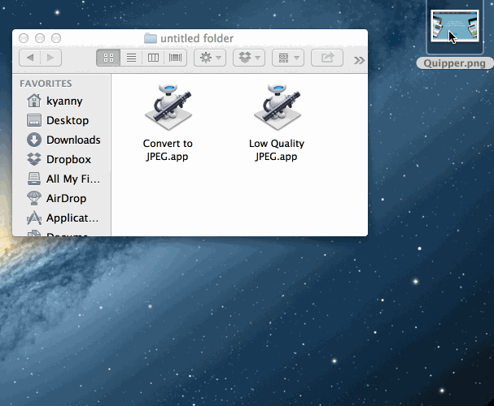
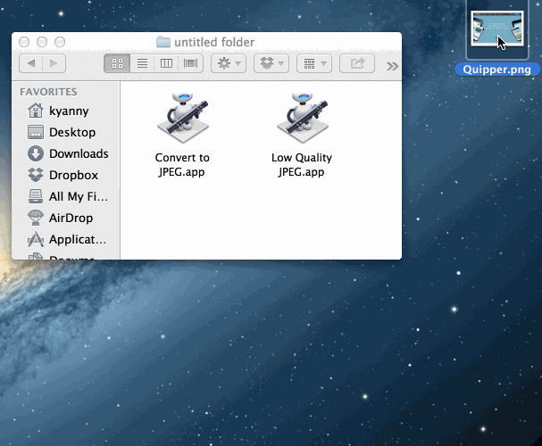

Automator JPEG Tools
====================

Automator JPEG convert tools

## Convert To JPEG

To convert any files to JPEG.

It's useful for convert screenshot PNG images to JPEG.




## Low Quality JPEG

To convert any files to JPEG with low quality.

It's useful for convert screenshot PNG images to JPEG with reduced size (expecially friendly with Qiita's upload size limit)




## Apps

Automator applications for drag & drop operation.

## Services

Automator services as right-click context menu in Finder.

## Scripting

Low quality convert job is by `sips` command.

```bash
for f in "$@"
do
	sips -s format jpeg -s formatOptions low --out "${f%.*}.jpg" "$f"
done
```
